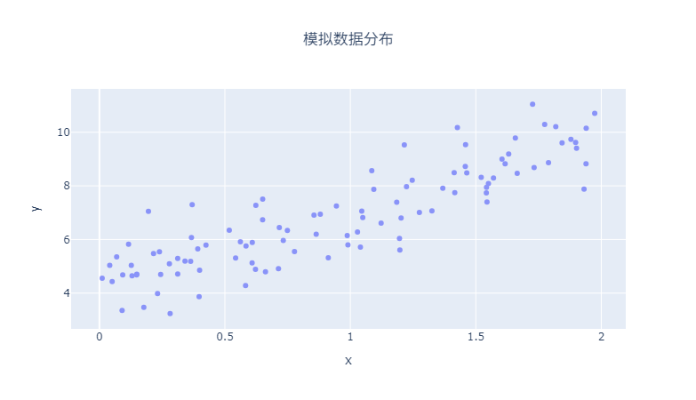
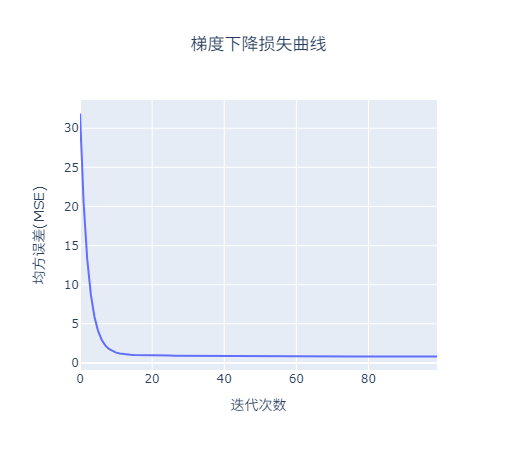
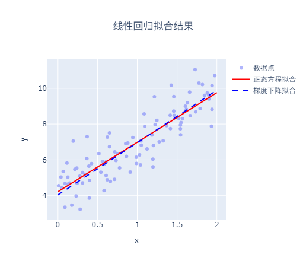

# 极简线性回归：概念、数学与Python实现

本文将从概念、数学推导与动手实现三个方面，极简地呈现线性回归模型的核心知识。

- [极简线性回归：概念、数学与Python实现](#极简线性回归概念数学与python实现)
  - [1. 什么是线性回归？](#1-什么是线性回归)
  - [2. 线性回归的数学原理](#2-线性回归的数学原理)
    - [2.1 最小二乘损失函数](#21-最小二乘损失函数)
    - [2.2 梯度下降法](#22-梯度下降法)
    - [2.3 正态方程（闭式解）](#23-正态方程闭式解)
  - [3. 从0用 Python 代码训练一个线性回归模型](#3-从0用-python-代码训练一个线性回归模型)
    - [3.1 导入必要库并生成模拟数据](#31-导入必要库并生成模拟数据)
    - [3.2 正态方程解法](#32-正态方程解法)
    - [3.3 梯度下降法](#33-梯度下降法)
    - [3.4 可视化拟合结果](#34-可视化拟合结果)
    - [3.5 计算均方误差](#35-计算均方误差)
1. 首先，我们在“什么是线性回归”部分定义其内涵与常见应用；
2. 接着，在“线性回归的数学原理”中推导最小二乘损失函数、梯度与正态方程；
3. 最后，通过Jupyter Notebook，用 Python 从零实现线性回归。

## 1. 什么是线性回归？

线性回归是一种 **监督学习** 算法，用于估计因变量 $y$ 与一个或多个自变量 $x$ 之间的线性关系。
简单线性回归仅含一个自变量，模型形式为

$$
y = \beta_0 + \beta_1 x + \varepsilon,
$$

其中 $\beta_0$ 为截距，$\beta_1$ 为斜率，$\varepsilon$ 为误差项。
多元线性回归则推广到多自变量，记作

$$
\mathbf{y} = \mathbf{X}\boldsymbol\beta + \boldsymbol\varepsilon,
$$

其中 $\mathbf{X}$ 是设计矩阵，$\boldsymbol\beta$ 是待估参数向量。

**常见应用**：预测房价、销售额或生物测量值等，既可用于 **预测**，也可用于 **解释** 自变量对响应变量变化的贡献。

## 2. 线性回归的数学原理

### 2.1 最小二乘损失函数

我们以训练集 $\{(x_i,y_i)\}_{i=1}^n$ 为例，定义 **均方误差（MSE）** 作为目标函数：

$$
J(\beta_0,\beta_1) = \frac{1}{2n} \sum_{i=1}^n \bigl(y_i - (\beta_0 + \beta_1 x_i)\bigr)^2.
$$

该函数对参数的导数即梯度，用于后续优化。

### 2.2 梯度下降法

对 $\beta_0,\beta_1$ 求偏导，并以学习率 $\alpha$ 迭代更新：

$$
\begin{aligned}
\beta_0 &\leftarrow \beta_0 - \alpha \frac{\partial J}{\partial \beta_0},\\
\beta_1 &\leftarrow \beta_1 - \alpha \frac{\partial J}{\partial \beta_1},
\end{aligned}
$$

其中

$$
\frac{\partial J}{\partial \beta_0} = -\frac{1}{n} \sum_{i=1}^n \bigl(y_i - (\beta_0 + \beta_1 x_i)\bigr),\quad
\frac{\partial J}{\partial \beta_1} = -\frac{1}{n} \sum_{i=1}^n \bigl(y_i - (\beta_0 + \beta_1 x_i)\bigr)x_i.
$$

此方法适用于大规模特征或无闭式解时。

### 2.3 正态方程（闭式解）

对于多元情况，可直接求解使 MSE 最小的参数：

$$
\boldsymbol\beta = (\mathbf{X}^\top \mathbf{X})^{-1} \mathbf{X}^\top \mathbf{y}.
$$

该公式称为 **正态方程**，在特征数较少时比梯度下降更高效。

## 3. 从0用 Python 代码训练一个线性回归模型

[完整代码查看 LinearRegression.ipynb](LinearRegression.ipynb)

### 3.1 导入必要库并生成模拟数据
首先，我们需要导入用于数值计算的 numpy 和用于可视化的 plotly。通过设置随机种子保证实验可复现，然后生成一组符合线性关系的数据（$y = 4 + 3x + \text{噪声}$），并用散点图展示数据分布。

```python
import numpy as np
import plotly.graph_objects as go

np.random.seed(42)
X = 2 * np.random.rand(100, 1)
y = 4 + 3 * X + np.random.randn(100, 1)

fig = go.Figure(
    data=[
        go.Scatter(
            x=X.flatten(),
            y=y.flatten(),
            mode='markers',
            opacity=0.7,
            name='数据点'
        )
    ]
)
fig.update_layout(
    title="模拟数据分布",
    title_x=0.5,
    xaxis_title="x",
    yaxis_title="y"
)
fig.show()
```
运行结果图如下：

### 3.2 正态方程解法
正态方程是线性回归的解析解。核心公式为：

$$ \beta = (X^T X)^{-1} X^T y $$
正确的实现代码如下：
```python
def normal_equation(X, y):
    X_b = np.c_[np.ones((len(X), 1)), X]
    theta_best = np.linalg.inv(X_b.T.dot(X_b)).dot(X_b.T).dot(y)
    return theta_best

theta = normal_equation(X, y)
print(f"求解得到参数：截距 = {theta[0][0]:.2f}, 斜率 = {theta[1][0]:.2f}")
```
运行上述代码，可以得到以下结果：求解得到参数：截距 = 4.22, 斜率 = 2.77

### 3.3 梯度下降法
梯度下降是一种常用的优化算法，适合大规模数据。我们实现了 gradient_descent 函数，迭代更新参数，并记录每次的损失（均方误差）
```python
def gradient_descent(X, y, lr=0.1, n_iters=1000):
    X_b = np.c_[np.ones((len(X),1)), X]
    theta = np.zeros((2,1))
    m = len(X_b)
    losses = []
    for i in range(n_iters):
        gradients = 2/m * X_b.T.dot(X_b.dot(theta) - y)
        theta -= lr * gradients
        loss = np.mean((X_b.dot(theta) - y) ** 2)
        losses.append(loss)
    return theta, losses

theta_gd, losses = gradient_descent(X, y, lr=0.05, n_iters=100)
print(f"梯度下降得到参数：截距 = {theta_gd[0][0]:.2f}, 斜率 = {theta_gd[1][0]:.2f}")
```
运行上述代码，可以得到以下结果：梯度下降得到参数：截距 = 4.04, 斜率 = 2.93
可视化损失曲线：

可视化损失曲线代码如下：
```python
fig_loss = go.Figure()
fig_loss.add_trace(go.Scatter(
    y=losses,
    mode='lines',
    name='训练损失(MSE)'
))
fig_loss.update_layout(
    title="梯度下降损失曲线",
    title_x=0.5,
    xaxis_title="迭代次数",
    yaxis_title="均方误差(MSE)"
)
fig_loss.show()
```

### 3.4 可视化拟合结果

将正态方程和梯度下降得到的参数分别画出拟合直线，与原始数据点对比。
绘制拟合曲线的代码如下：
```python
X_new = np.array([[0],[2]])
y_pred_ne = theta[0] + theta[1] * X_new
y_pred_gd = theta_gd[0] + theta_gd[1] * X_new

fig = go.Figure()
fig.add_trace(
    go.Scatter(
        x=X.flatten(),
        y=y.flatten(),
        mode='markers',
        opacity=0.5,
        name='数据点'
    )
)
fig.add_trace(
    go.Scatter(
        x=X_new.flatten(),
        y=y_pred_ne.flatten(),
        mode='lines',
        name='正态方程拟合',
        line=dict(color='red')
    )
)
fig.add_trace(
    go.Scatter(
        x=X_new.flatten(),
        y=y_pred_gd.flatten(),
        mode='lines',
        name='梯度下降拟合',
        line=dict(color='blue', dash='dash')
    )
)
fig.update_layout(
    title="线性回归拟合结果",
    title_x=0.5,
    xaxis_title="x",
    yaxis_title="y"
)
fig.show()
```
可视化拟合曲线：

### 3.5 计算均方误差
用 sklearn.metrics.mean_squared_error 计算两种方法的预测结果与真实值之间的均方误差，量化模型性能。

```python
from sklearn.metrics import mean_squared_error

y_pred_ne_all = np.c_[np.ones((100,1)), X].dot(theta)
y_pred_gd_all = np.c_[np.ones((100,1)), X].dot(theta_gd)

mse_ne = mean_squared_error(y, y_pred_ne_all)
mse_gd = mean_squared_error(y, y_pred_gd_all)

print(f"MSE (正态方程) = {mse_ne:.2f}, MSE (梯度下降) = {mse_gd:.2f}")
```
运行上述代码，可以得到以下结果：MSE (正态方程) = 0.81, MSE (梯度下降) = 0.82

