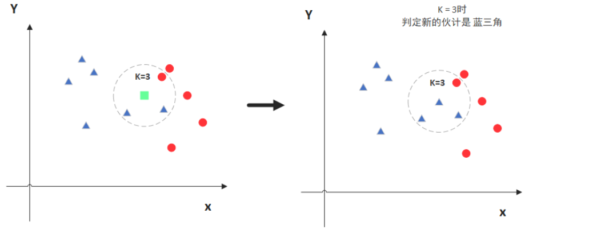

# K-近邻（KNN）算法理论与实践

## 1. 理论介绍

### 什么是K-近邻（KNN）算法

K-近邻（K-Nearest Neighbors，KNN）是一种简单而有效的监督学习算法，用于分类和回归问题。它基于实例学习的思想，将新数据点分配到训练数据集中**最相近的K个样本所属的类别**。KNN不需要明确的训练过程，因此被称为"懒惰学习"（lazy learning）算法。

借用网上的一张图，可以直观地理解KNN算法的工作原理：

### KNN算法的基本原理

1.  **距离计算**：计算新样本与训练集中所有样本之间的距离
2.  **邻居选择**：选择距离最近的K个邻居
3.  **投票决策**：对于分类问题，根据K个邻居的多数类别作为新样本的预测类别；对于回归问题，取K个邻居的平均值或加权平均值

### 常用距离度量方式

* **欧氏距离（Euclidean Distance）**
    $$d(x, y) = \sqrt{\sum_{i=1}^{n} (x_i - y_i)^2}$$

* **曼哈顿距离（Manhattan Distance）**
    $$d(x, y) = \sum_{i=1}^{n} |x_i - y_i|$$

* **明可夫斯基距离（Minkowski Distance）**
    $$d(x, y) = \left(\sum_{i=1}^{n} |x_i - y_i|^p\right)^{1/p}$$
    * 当p=1时，等同于曼哈顿距离
    * 当p=2时，等同于欧氏距离

### K值的选择

* **K值过小**：模型过于复杂，容易受噪声影响，导致过拟合
* **K值过大**：模型过于简单，无法捕捉数据的复杂模式，导致欠拟合
* 一般来说，K值可以通过交叉验证从一组候选值中选择

### KNN算法优缺点

**优点：**

* 简单易于理解和实现
* 无需训练过程，可以直接用于分类
* 对非线性决策边界效果良好
* 对异常值相对鲁棒

**缺点：**

* 计算复杂度高，需要计算与所有训练样本的距离
* 存储开销大，需要保存所有训练样本
* 对特征尺度敏感，通常需要标准化
* 当样本分布不均衡时，容易被多数类主导

## 2. Python实现KNN（基于乳腺癌数据集）

下面我们将使用提供的[data数据集](data/data.csv)实现KNN算法，不使用任何高级API。
详细代码见[KNN.ipynb](KNN.ipynb)