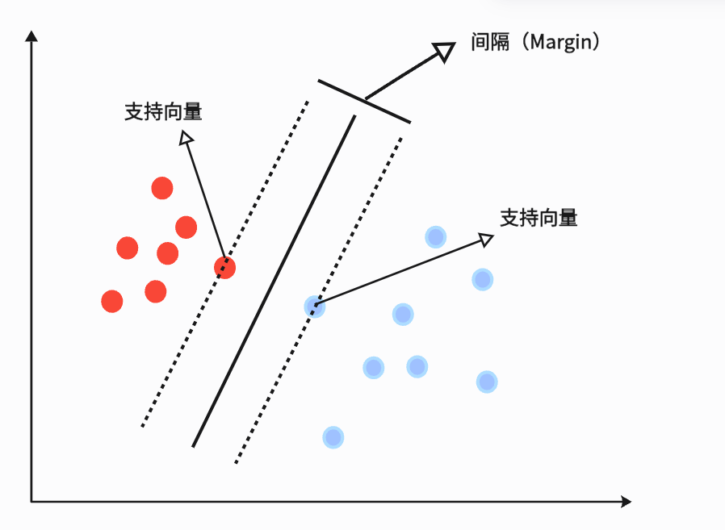

# 支持向量机（SVM）算法理论与实践

## 1. SVM是什么？（通俗解释）

支持向量机（SVM）是一种常用的分类算法。它的核心思想是：**在所有能把两类数据分开的直线（或超平面）中，找到“离两类数据最近的点最远”的那一条**。

### 举个例子

假设你有一堆红球和蓝球，散落在桌面上（二维平面）。你要用一把尺子（直线）把红球和蓝球分开。你会怎么放这把尺子？

- 你可能会发现，有很多种放法都能把红球和蓝球分开。
- SVM的做法是：**找一条让红球和蓝球离尺子最近的距离最大**的直线。这样分得最“安全”，新来的球也更容易分对。

---

## 2. SVM的数学原理（简单版）

### 2.1 间隔（Margin）是什么？

- **间隔**就是“离分界线最近的点的距离”。
- SVM要做的就是让这个距离最大。

### 2.2 SVM的目标

假设分界线的公式是 $w_1x_1 + w_2x_2 + b = 0$，SVM的目标是：

> 找到 $w_1, w_2, b$，让所有点都被正确分开，并且最近的点离分界线的距离最大。

### 2.3 支持向量

- **支持向量**就是那些“离分界线最近的点”。
- 只有这些点决定了分界线的位置，其他点怎么动都不会影响分界线。

#### 例子

假如你有如下数据：

| x1 | x2 | 类别 |
|----|----|------|
| 1  | 2  | 红   |
| 2  | 3  | 红   |
| 2  | 0  | 蓝   |
| 3  | 1  | 蓝   |

SVM会找到一条直线，把红和蓝分开，并且让离直线最近的红球和蓝球距离最大。

---

## 3. SVM怎么处理分不开的情况？

现实中，数据可能分不开（有噪声、重叠）。SVM允许有些点分错，但会对分错的点进行“惩罚”，这叫**软间隔**。

- 惩罚的大小由参数 $C$ 控制，$C$越大，越不允许分错。

---

## 4. SVM怎么处理非线性问题？

有时候，数据不是一条直线能分开的，比如像圆圈一样分布。SVM有个“核技巧”，可以把数据映射到高维空间，让它变得线性可分。

- 常用的核函数有：线性核、多项式核、高斯核（RBF）。

#### 例子

- 原空间：红球在圆心，蓝球在圆环上，一条直线分不开。
- 映射到高维空间后，可以用一个平面分开。

---

## 5. SVM的优缺点

**优点：**
- 分类效果好，尤其是间隔大的情况
- 可以处理高维数据
- 可以用核函数处理非线性问题

**缺点：**
- 对大数据集训练慢
- 对参数和核函数敏感
- 不适合太多噪声的数据

---

## 6. SVM小结

- SVM就是“最大间隔分界线”
- 支持向量决定分界线
- 可以处理分不开和非线性问题（软间隔、核技巧）

---

## 7. Python实现SVM（基于乳腺癌数据集）

我们将用sklearn的SVC实现SVM分类，并可视化决策边界。详细代码见[SVM.ipynb](SVM.ipynb)